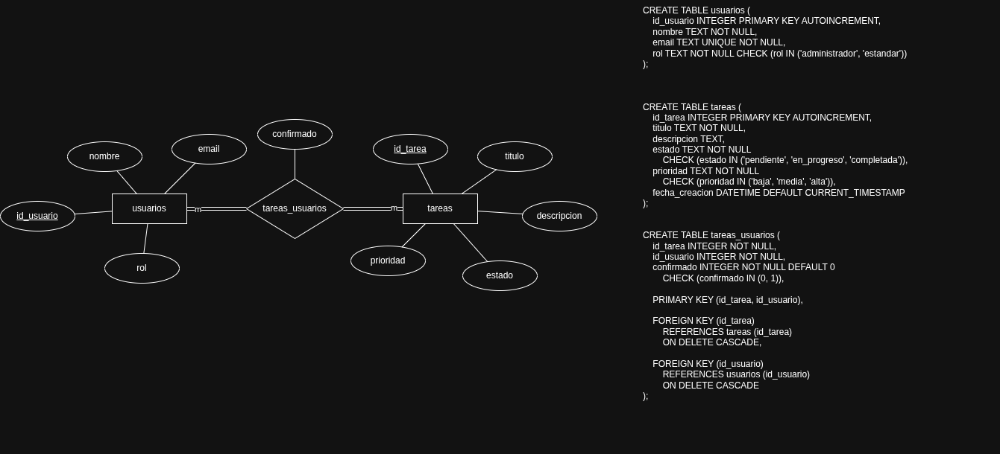
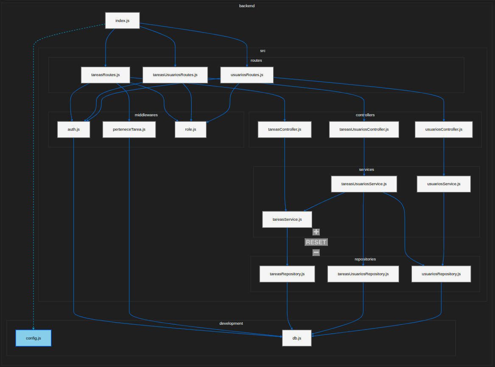

# backend

requisitos:
- nodejs
- npm
- sqlite3 (se instala solo)

instalacion y uso:
1. ir a la carpeta backend
2. correr:
   - npm install
   - npm run start

---


**Ejemplo de usuarios a probar:**
```
                id: 1 ('Usuario 1', 'user1@test.com', 'administrador'),
                id: 2 ('Usuario 2', 'user2@test.com', 'estandar'),
                id: 3 ('Usuario 3', 'user3@test.com', 'estandar'),
                id: 4 ('Usuario 4', 'user4@test.com', 'estandar'),
                id: 5 ('Usuario 5', 'user5@test.com', 'estandar')
```
---

la base de datos se crea sola en development/db.js

endpoints principales:
- /api/usuarios
- /api/tareas
- /api/tareas-usuarios

estructura:
- routes
- controllers
- services
- repositories

cambiar motor de base de datos:
- por defecto usa sqlite3
- para otro motor, cambia development/db.js y los metodos en repositories/
- instala el paquete del motor nuevo y ajusta la conexion

**Documentacion nos ayudara a usar otras bases de datos**: https://expressjs.com/en/guide/database-integration.html


# Adicional con ayuda de Draw.io y Extension "codevisualizer"

*mer*



*backend*




# comentarios
Herramientas:
    - Node.js
    - Express

instalacion:
- `npm init`
- `npm install express`

acontinuacion editar package.json:

```
"scripts": {
  "start": "node src/index.js",
  "dev": "node --watch src/index.js"
}
```

se uso sqlite3, debemos crear la bd: `node development/db.js`.

documentacion: https://expressjs.com/es/starter/hello-world.html

- **Mantenibilidad** Con el fin de manejar las URLs eficientemente ya sea de produccion o desarrollo, el manejo se hara en:  /development/config.js.

Arquitectura utilizada: Sistema en Capaz

Tenemos la siguiente jerarquia:

- Routes
- Controllers

